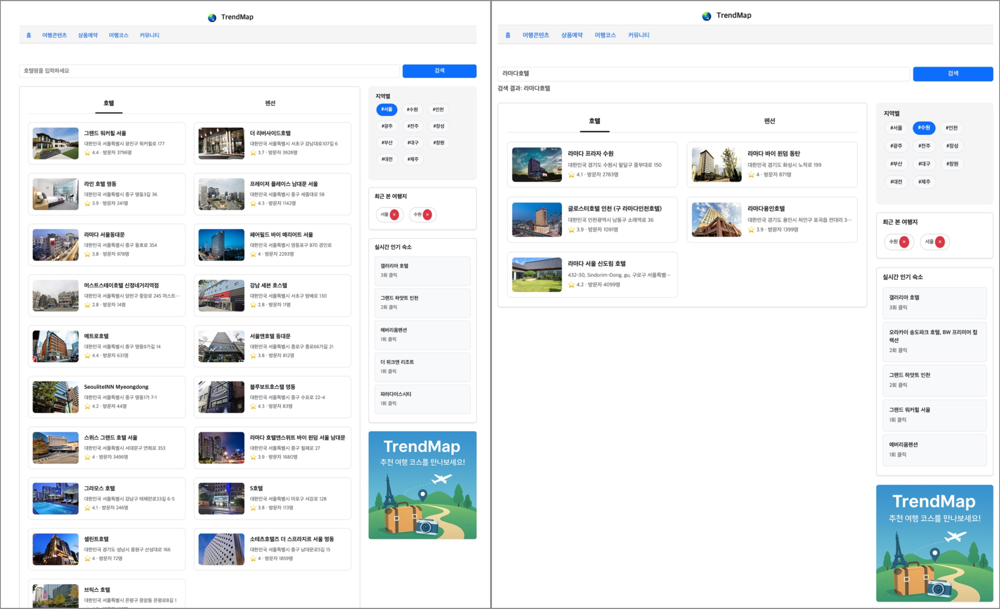
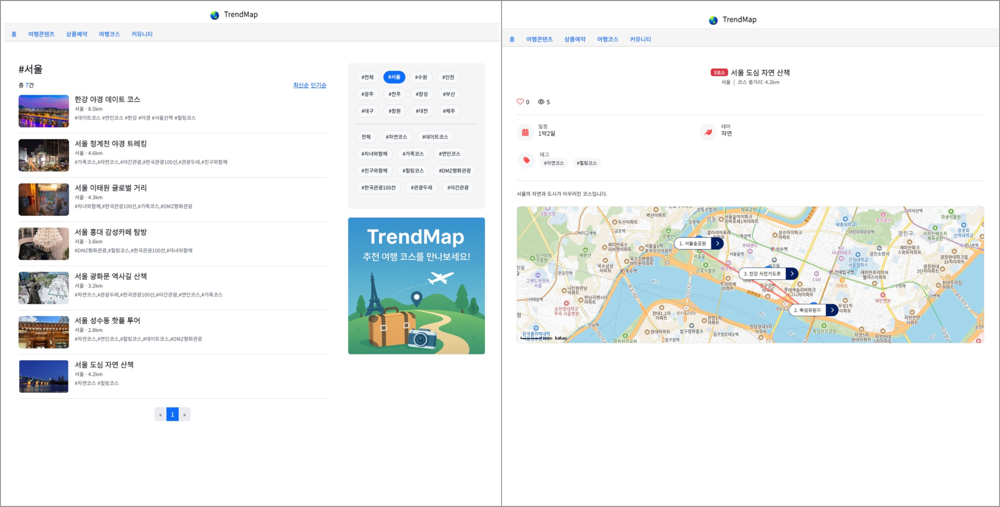
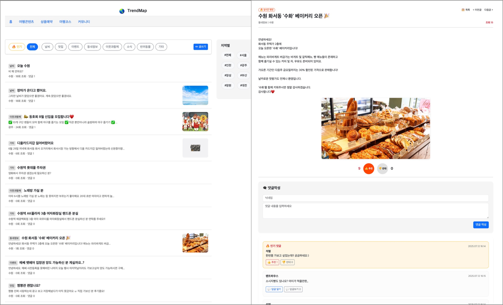

# 🌎 TrendMap

Spring Boot 기반의 **지역 실시간 트렌드 시각화 플랫폼**입니다.

사용자는 지역을 선택하여 실시간으로 제공되는 **뉴스**, **검색어**, **블로그 핫 해시태그**, **장소 추천**, **여행 코스**, **사용자 제보**, **날씨**, **행사 캘린더** 등 다양한 트렌드를 한눈에 확인할 수 있습니다.

---

## 프로젝트 개요 요약표

|         항목           |                     내용                            |
|-----------------------|----------------------------------------------------|
|      프로젝트 명         |     TrendMap (지역 실시간 트렌드 시각화)                 |
|       개발 기간         |      2025.06 ~  2025.07 (약 6주)                    |
|       담당 역할         |      개인 개발 (기획, 프론트, 백엔드)                     |
|       기술 스택         |      Spring Boot, Thymeleaf, Selenium, MySQL 등     |
|       주요 기능         |      지역별 뉴스, 검색어, 장소 추천, 커뮤니티 등 제공         |


---
## 💡 주요 기능

### 📍 지역 기반 실시간 정보

- 지역 선택 -> 해당 지역의 실시간 정보 한눈에 확인
- 뉴스, 날씨, 유튜브, 실시간 키워드 모두 통합하여 제공

### 📰 실시간 지역 뉴스

- 크롤링 기반 뉴스 수집 (Selenium 활용)
- 뉴스 이미지 / 제목 / 요약 / 원문 링크 제공

### 🔥 실시간 해시태그

- 지역 블로그에서 자주 등장하는 태그 자동 수집
- 상위 10개 태그를 실시간으로 UI에 반영

### 🌤️ 지역 날씨 & 행사 정보

- OpenWeatherMap API + FullCalendar.js
- 현재 날씨와 이번주 지역 행사 달력 제공

### 🏞️ 장소 추천 (에디터 PICK)
- 지역 + 카테고리 별 장소 카드형 추천
- 데이트 / 아이와 / 포토존 / 대형카페 등으로 필터링

### 🏨 호텔 검색

- 지역 기반 호텔/펜션 리스트 조회
- Google Places API 기반 실시간 이미지 / 평점 / 위치 제공
- 인기 순 클릭 통계 표시

### 🧭 여행 코스 추천
- 관광공사 기반 대표 여행 코스 정리
- 코스별 장소 정보 + 태그 + 거리/시간 표시

### 🗣️ 지역 제보 커뮤니티
- 회원가입 없이 닉네임만으로 제보 가능
- 이미지 포함된 카드형 게시글
- 댓글 / 좋아요 / 베스트 댓글 / 대댓글 / 게시글 추천 및 비추천 지원

---

## 🖼️ 주요 화면 구성 (UI 캡처)

### 1. 지역 대시보드 - 실시간 트렌드 한눈에 보기
서울, 수원 등 지역별로 실시간 뉴스, 날씨, 추천 장소, 행사 등을 한 페이지에서 확인할 수 있습니다.


---

### 2. 에디터 PICK + 여행 콘텐츠
카테고리(데이트, 아이와, 대형카페 등)에 따라 가볼 만한 장소들을 슬라이드 카드로 추천합니다.
하단에는 지역별 블로그 기반 콘텐츠를 주제별(관광/음식/기초정보 등)로 보여줍니다.


---

### 3. 숙소 검색 기능 (호텔/펜션)
지역과 키워드 기반으로 숙소를 검색하고, 인기순 정렬 및 상세 정보 확인이 가능합니다.



---

### 4. 여행 코스 추천 + 지도 시각화
지역별 대표 여행 코스를 단계별로 보여주며, 각 장소를 지도 위에 표시하여 동선을 쉽게 확인할 수 있습니다.



---

### 5. 지역 커뮤니티 - 제보 및 소통
누구나 지역 소식을 제보할 수 있고, 글/댓글/추천/비추천 등의 기능을 통해 소통할 수 있는 공간입니다.



---

## 🛠️ 기술 스택
|           영역           |                             기술                             |
|-------------------------|-------------------------------------------------------------|
|        Languages        |     Java 17                                                 |
|        Framework        |     Spring Boot 3.x, Spring MVC, Spring Data JPA            |
|          View           |     Thymeleaf, Bootstrap 5                                  |
|        Database         |     MySQL 8.x                                               |
|          ORM            |     Hibernate (JPA)                                         |
|        Build Tool       |     Gradle                                                  |
|       Web Crawling      |     Selenium, Jsoup                                         |
|        Scheduler        |     Spring Scheduler                                        |
|         API 활용         |     Google Maps API, OpenWeatherMap API                     |
|         유틸리티          |     Lombok, JSTL                                            |

---

## 🗂️ 프로젝트 구조

<details>
<summary>📁 프로젝트 구조 보기</summary>
    
````text
src/
├── main/
│   ├── java/
│   │   └── com.realtimeradar/
│   │       ├── config/
│   │       │   └── WebConfig.java
│   │       ├── controller/
│   │       │   ├── CommentController.java
│   │       │   ├── CourseController.java
│   │       │   ├── HashtagController.java
│   │       │   ├── HomeController.java
│   │       │   ├── HotelController.java
│   │       │   ├── NewsController.java
│   │       │   ├── PlaceController.java
│   │       │   ├── ReportController.java
│   │       │   ├── TravelContentController.java
│   │       │   └── TrendController.java
│   │       ├── crawler/
│   │       │   └── HashtagCrawler.java
│   │       ├── dto/
│   │       │   ├── CommentDTO.java
│   │       │   ├── CourseDTO.java
│   │       │   ├── EventDTO.java
│   │       │   ├── HotelDTO.java
│   │       │   ├── NewsApiResponse.java
│   │       │   ├── NewsDTO.java
│   │       │   ├── PlaceDTO.java
│   │       │   ├── ReportDTO.java
│   │       │   └── TrendKeywordDTO.java
│   │       ├── entity/
│   │       │   ├── Comment.java
│   │       │   ├── Course.java
│   │       │   ├── CourseLocation.java
│   │       │   ├── Hashtag.java
│   │       │   ├── HotelClick.java
│   │       │   ├── Keyword.java
│   │       │   ├── News.java
│   │       │   ├── Place.java
│   │       │   ├── RegionKeywordCount.java
│   │       │   ├── Report.java
│   │       │   ├── TravelCategory.java
│   │       │   └── TrendingKeyword.java
│   │       ├── repository/
│   │       │   ├── CommentRepository.java
│   │       │   ├── CourseLocationRepository.java
│   │       │   ├── CourseRepository.java
│   │       │   ├── HashtagRepository.java
│   │       │   ├── HotelClickRepository.java
│   │       │   ├── KeywordRepository.java
│   │       │   ├── NewsRepository.java
│   │       │   ├── PlaceRepository.java
│   │       │   ├── ReportRepository.java
│   │       │   ├── TravelCategoryRepository.java
│   │       │   └── TrendRepository.java
│   │       ├── service/
│   │       │   ├── BlogHashtagService.java
│   │       │   ├── CommentService.java
│   │       │   ├── CommentServiceImpl.java
│   │       │   ├── CourseService.java
│   │       │   ├── CourseServiceImpl.java
│   │       │   ├── EventService.java
│   │       │   ├── FileUploadService.java
│   │       │   ├── HashtagService.java
│   │       │   ├── HotelSearchService.java
│   │       │   ├── KeywordService.java
│   │       │   ├── NewsService.java
│   │       │   ├── PlaceService.java
│   │       │   ├── PlaceServiceImpl.java
│   │       │   ├── ReportService.java
│   │       │   ├── ReportServiceImpl.java
│   │       │   ├── TravelCategoryService.java
│   │       │   ├── WeatherService.java
│   │       │   └── YoutubeSearchService.java
│   │       └── RadarApplication.java
│
├── resources/
│   ├── static/
│   │   ├── css/
│   │   │   └── main.css
│   │   ├── js/
│   │   │   └── place-filter.js
│   │   └── images/
│   ├── templates/
│   │   ├── course/
│   │   │   ├── course-detail.html
│   │   │   └── course-list.html
│   │   ├── error/
│   │   │   └── 404.html
│   │   ├── fragments/
│   │   │   └── header.html
│   │   ├── report/
│   │   │   ├── report-detail.html
│   │   │   ├── report-list.html
│   │   │   └── report-write.html
│   │   ├── home.html
│   │   ├── hotel-search.html
│   │   ├── travel-content.html
│   │   └── trending.html
│   └── application.properties
│
└── test/
    └── java/
        └── com.realtimeradar/
            └── (Test Classes)   

```` 
</details> 
---

## 🔧 실행 방법

### 1. `application.properties` 환경 설정
```properties
spring.datasource.url=jdbc:mysql://localhost:3306/radar_db
spring.datasource.username=root
spring.datasource.password=12345678
spring.jpa.hibernate.ddl-auto=update
google.api.key=YOUR_GOOGLE_API_KEY
openweather.api.key=YOUR_OPENWEATHER_API_KEY
```

### 2. Gradle 빌드 및 서버 실행
./gradlew bootRun

### 3. 브라우저에서 접속
[http://localhost:8080/realtime-news?region=수원](http://localhost:8080/realtime-news?region=수원)

---

### 👩🏻‍💻 개발자 정보
* 김혜서
* GitHub : @hyeseo-kim
* Email : hyeseo0614@gmail.com

---

### 🚀 향후 개선 예정 기능

- ✅ 카카오톡 공유 기능 (진행중)
- ⏳ 사용자 즐겨찾기 장소 저장
- ⏳ 지역 별 인기 여행지 순위
- ⏳ 다국어 지원

---

### 🎥 데모 영상
(추후 배포 또는 영상 업로드 시 링크 삽입 예정)

---


