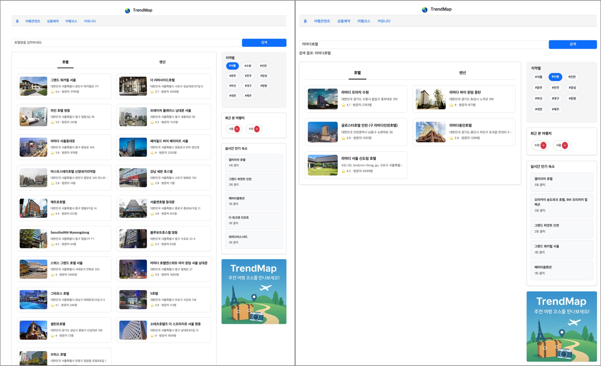
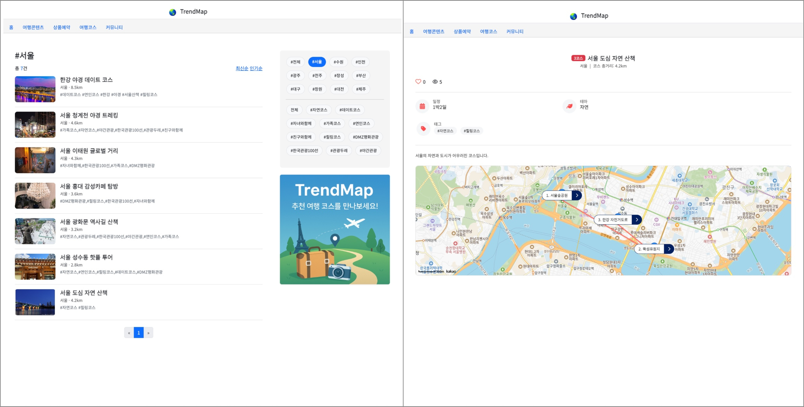
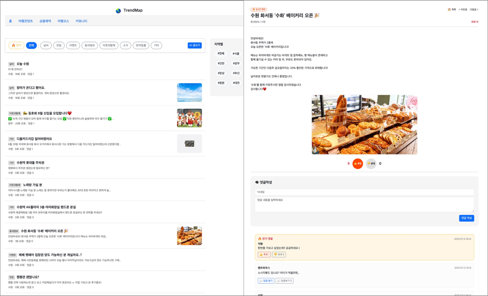
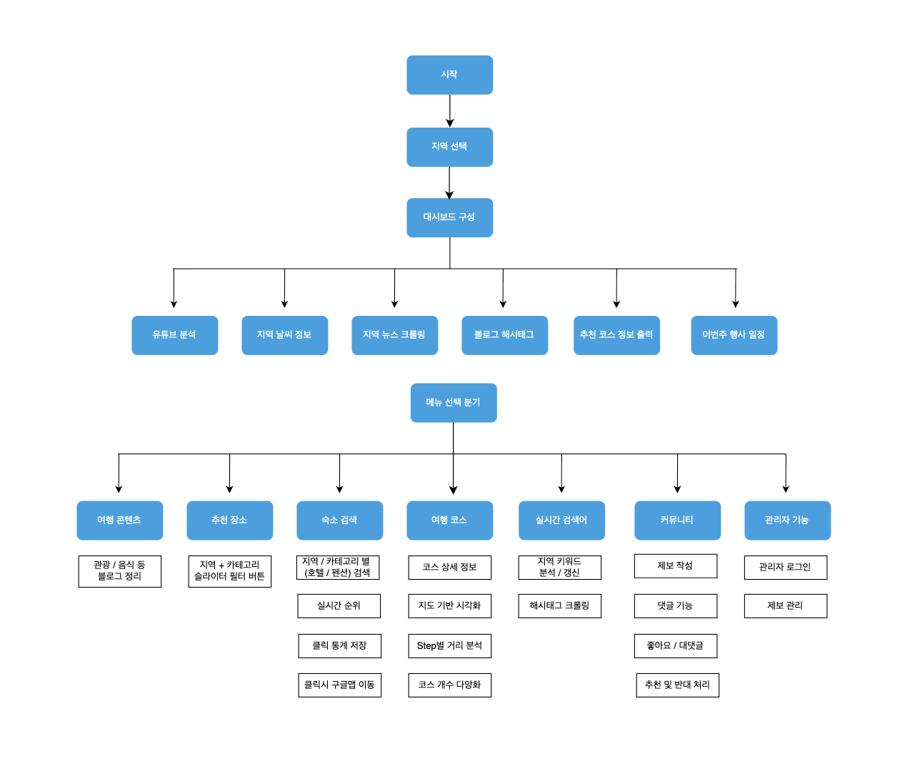

# 🌎 TrendMap - 우리 동네 트렌드맵

Spring Boot 기반의 **지역 실시간 트렌드 시각화 플랫폼**입니다.

사용자는 지역을 선택하여 실시간으로 제공되는 **뉴스**, **검색어**, **블로그 핫 해시태그**, **장소 추천**, **여행 코스**, **사용자 제보**, **날씨**, **행사 캘린더** 등 다양한 트렌드를 한눈에 확인할 수 있습니다.

---

## 프로젝트 개요

|         항목             |                         내용                                 |
|-------------------------|-------------------------------------------------------------|
|       프로젝트 명          |     TrendMap (지역 실시간 트렌드 시각화)                          |
|        개발 기간          |      2025.06 ~  2025.07 (약 6주)                             |
|        담당 역할          |      개인 개발 (기획, 프론트, 백엔드)                              |
|        주요 기능          |      뉴스, 검색어, 장소 추천, 여행 코스, 날씨, 행사 캘린더 등           |
|        GitHub           |      https://github.com/hyeseo-kim/TrendMap                 |

---

## 기술 스택
|           영역           |                             기술                             |
|-------------------------|-------------------------------------------------------------|
|        Languages        |     Java 17                                                 |
|        Framework        |     Spring Boot 3.x, Spring MVC, Spring Data JPA            |
|          View           |     Thymeleaf, Bootstrap 5                                  |
|        Database         |     MySQL 8.x                                               |
|          ORM            |     Hibernate (JPA)                                         |
|        Build Tool       |     Gradle                                                  |
|       Web Crawling      |     Selenium, Jsoup                                         |
|        Scheduler        |     Spring Scheduler                                        |
|         API 활용         |     Google Maps API, OpenWeatherMap API                     |
|         유틸리티          |     Lombok, JSTL                                            |

---

## 💡 주요 기능 및 화면 미리보기

### 1. 지역 대시보드 - 실시간 트렌드 한눈에 보기

- 지역 선택 시 뉴스 / 날씨 / 키워드 / 추천 장소 / 행사 정보 통합 제공


---

### 2. 에디터 PICK + 블로그 기반 콘텐츠

- 카테고리(데이트, 아이와, 포토존 등) 필터 제공
- 지역별 블로그 콘텐츠를 관광/음식/기초정보 등으로 분류


---

### 3. 숙소 검색 기능 (호텔/펜션)

- 지역 기반 호텔/펜션 리스트 출력
- 실시간 이미지, 평점, 위치 제공
- 인기 순 클릭 통계 반영



---

### 4. 여행 코스 추천 + 지도 시각화

- 관광공사 기반 코스 정보 정리
- 장소별 거리/시간 계산 및 지도 시각화



---

### 5. 지역 커뮤니티 - 제보 및 소통

- 회원가입 없이 닉네임만으로 제보 가능
- 댓글 / 좋아요 / 대댓글 / 추천/비추천 기능 제공



---

## 전체 흐름도

아래는 사용자의 기본적인 서비스 흐름입니다:

````mermaid
graph TD
A[홈 접속] --> B[지역 선택]
B --> C[뉴스, 날씨, 장소 추천 등 통합 제공]
C --> D{더보기 클릭}
D --> E1[코스 추천 확인]
D --> E2[여행 콘텐츠 탐색]
D --> E3[호텔/펜션 검색]
D --> E4[제보 커뮤니티 글 등록]
````

<p align="center">
  
</p>

---

## 🗂️ 프로젝트 구조

<details>
<summary>📁 프로젝트 구조 보기</summary>
    
````text
src/
├── main/
│   ├── java/
│   │   └── com.realtimeradar/
│   │       ├── config/
│   │       │   └── WebConfig.java
│   │       ├── controller/
│   │       │   ├── CommentController.java
│   │       │   ├── CourseController.java
│   │       │   ├── HashtagController.java
│   │       │   ├── HomeController.java
│   │       │   ├── HotelController.java
│   │       │   ├── NewsController.java
│   │       │   ├── PlaceController.java
│   │       │   ├── ReportController.java
│   │       │   ├── TravelContentController.java
│   │       │   └── TrendController.java
│   │       ├── crawler/
│   │       │   └── HashtagCrawler.java
│   │       ├── dto/
│   │       │   ├── CommentDTO.java
│   │       │   ├── CourseDTO.java
│   │       │   ├── EventDTO.java
│   │       │   ├── HotelDTO.java
│   │       │   ├── NewsApiResponse.java
│   │       │   ├── NewsDTO.java
│   │       │   ├── PlaceDTO.java
│   │       │   ├── ReportDTO.java
│   │       │   └── TrendKeywordDTO.java
│   │       ├── entity/
│   │       │   ├── Comment.java
│   │       │   ├── Course.java
│   │       │   ├── CourseLocation.java
│   │       │   ├── Hashtag.java
│   │       │   ├── HotelClick.java
│   │       │   ├── Keyword.java
│   │       │   ├── News.java
│   │       │   ├── Place.java
│   │       │   ├── RegionKeywordCount.java
│   │       │   ├── Report.java
│   │       │   ├── TravelCategory.java
│   │       │   └── TrendingKeyword.java
│   │       ├── repository/
│   │       │   ├── CommentRepository.java
│   │       │   ├── CourseLocationRepository.java
│   │       │   ├── CourseRepository.java
│   │       │   ├── HashtagRepository.java
│   │       │   ├── HotelClickRepository.java
│   │       │   ├── KeywordRepository.java
│   │       │   ├── NewsRepository.java
│   │       │   ├── PlaceRepository.java
│   │       │   ├── ReportRepository.java
│   │       │   ├── TravelCategoryRepository.java
│   │       │   └── TrendRepository.java
│   │       ├── service/
│   │       │   ├── BlogHashtagService.java
│   │       │   ├── CommentService.java
│   │       │   ├── CommentServiceImpl.java
│   │       │   ├── CourseService.java
│   │       │   ├── CourseServiceImpl.java
│   │       │   ├── EventService.java
│   │       │   ├── FileUploadService.java
│   │       │   ├── HashtagService.java
│   │       │   ├── HotelSearchService.java
│   │       │   ├── KeywordService.java
│   │       │   ├── NewsService.java
│   │       │   ├── PlaceService.java
│   │       │   ├── PlaceServiceImpl.java
│   │       │   ├── ReportService.java
│   │       │   ├── ReportServiceImpl.java
│   │       │   ├── TravelCategoryService.java
│   │       │   ├── WeatherService.java
│   │       │   └── YoutubeSearchService.java
│   │       └── RadarApplication.java
│
├── resources/
│   ├── static/
│   │   ├── css/
│   │   │   └── main.css
│   │   ├── js/
│   │   │   └── place-filter.js
│   │   └── images/
│   ├── templates/
│   │   ├── course/
│   │   │   ├── course-detail.html
│   │   │   └── course-list.html
│   │   ├── error/
│   │   │   └── 404.html
│   │   ├── fragments/
│   │   │   └── header.html
│   │   ├── report/
│   │   │   ├── report-detail.html
│   │   │   ├── report-list.html
│   │   │   └── report-write.html
│   │   ├── home.html
│   │   ├── hotel-search.html
│   │   ├── travel-content.html
│   │   └── trending.html
│   └── application.properties
│
└── test/
    └── java/
        └── com.realtimeradar/
            └── (Test Classes)   

```` 
</details> 
---

## 🔧 실행 방법

### 1. `application.properties` 환경 설정
```properties
spring.datasource.url=jdbc:mysql://localhost:3306/radar_db
spring.datasource.username=root
spring.datasource.password=12345678
spring.jpa.hibernate.ddl-auto=update
google.api.key=YOUR_GOOGLE_API_KEY
openweather.api.key=YOUR_OPENWEATHER_API_KEY
```

### 2. Gradle 빌드 및 서버 실행
./gradlew bootRun

### 3. 브라우저에서 접속
▶ http://localhost:8080/realtime-news?region=수원

---

## 👩🏻‍💻 개발자 정보

- 김혜서
- GitHub : @hyeseo-kim
- Email : hyeseo0614@gmail.com

---

### 🚀 향후 개선 예정 기능

- ✅ 카카오톡 공유 구현 완료
- ⏳ 사용자 즐겨찾기 장소 저장
- ⏳ 지역 별 인기 여행지 순위
- ⏳ 다국어 지원

---

### 🎥 데모 영상
(추후 배포 또는 영상 업로드 시 링크 삽입 예정)

---


